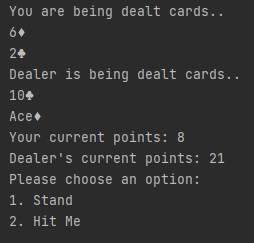

<!-- PROJECT LOGO -->
<br />
<p align="center">


<h3 align="center">Java Terminal Games</h3>

  <p align="center">
    An awesome project written with Java, play BlackJack and Coin Flip right from your terminal!
    <br />
    <br />
    <a href="https://github.com/manningb/javaTerminalGames">View Demo</a>
    ·
    <a href="https://github.com/manningb/javaTerminalGames/issues">Report Bug</a>
    ·
    <a href="https://github.com/manningb/javaTerminalGames/issues">Request Feature</a>
  </p>

<!-- TABLE OF CONTENTS -->
<details open="open">
  <summary>Table of Contents</summary>
  <ol>
    <li>
      <a href="#about-the-project">About The Project</a>
      <ul>
        <li><a href="#built-with">Built With</a></li>
      </ul>
    </li>
    <li>
      <a href="#getting-started">Getting Started</a>
      <ul>
        <li><a href="#prerequisites">Prerequisites</a></li>
        <li><a href="#installation">Installation</a></li>
      </ul>
    </li>
    <li><a href="#contributing">Contributing</a></li>
    <li><a href="#license">License</a></li>
    <li><a href="#contact">Contact</a></li>
  </ol>
</details>


<!-- ABOUT THE PROJECT -->
## About The Project
### Blackjack!
<br>

### Coin Flipping!
<br>

### Leaderboard
<br>


Features
* Play a coin flipping game and black jack
* Multiple different types of players, including an admin player that can clear the leaderboard and a vip that gets double betting balance
* Leaderboard and players are saved so you can continue where you left off

### Built With

* [Java 13](https://docs.oracle.com/en/java/javase/13/docs/api/index.html)


<!-- GETTING STARTED -->
## Getting Started

### Prerequisites

You must have Java installed to run this application. See [here](https://docs.oracle.com/en/java/javase/13/install/overview-jdk-installation.html) for installation details.

### Installation

1. Clone the repo
   ```sh
   git clone https://github.com/manningb/javaTerminalGames
   ```
2. Run it!


<!-- CONTRIBUTING -->
## Contributing

Contributions are what make the open source community such an amazing place to be learn, inspire, and create. Any contributions you make are **greatly appreciated**.

1. Fork the Project
2. Create your Feature Branch (`git checkout -b feature/AmazingFeature`)
3. Commit your Changes (`git commit -m 'Add some AmazingFeature'`)
4. Push to the Branch (`git push origin feature/AmazingFeature`)
5. Open a Pull Request


<!-- LICENSE -->
## License
Distributed under the MIT License. See `LICENSE` for more information.


<!-- CONTACT -->
## Contact

Brian Manning

Project Link: [https://github.com/manningb/javaTerminalGames](https://github.com/manningb/javaTerminalGames)